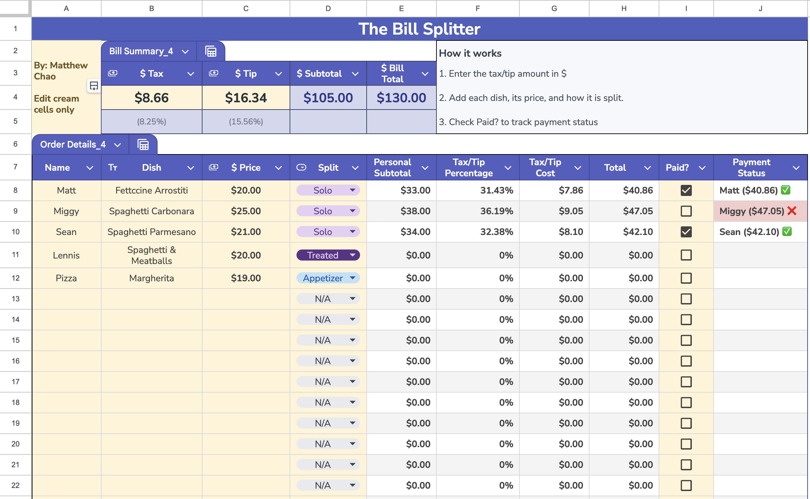

# Bill Splitter

An interactive Google Sheets tool that calculates each person’s share of a restaurant bill by distributing tax and tip proportionally based on what they ordered.

## Try the Tool

- [Open the live view-only Google Sheet](https://docs.google.com/spreadsheets/d/1-0OEzfQvqdNhFLnmtaB4zBMDblBRe6JLSUiSj21d2SE/edit?usp=sharing)
- [Download the Excel version](bill-splitter.xlsx)

## About This Project

I created this project after hearing about a group outing where the diners split the tax and tip evenly. Because my friend ordered a less expensive meal, he paid more in tax and tip than was proportional to his order.

This spreadsheet provides a fairer alternative by calculating each person’s tax and tip according to their share of the subtotal.

The project demonstrates how spreadsheet formulas and interface design can transform a repetitive calculation into a practical, user-friendly tool.

## Features

- Records each person’s individual food and drink costs
- Calculates each person’s percentage of the subtotal
- Distributes tax proportionally
- Distributes tip proportionally
- Calculates each person’s final amount owed
- Checks whether the individual totals match the full bill
- Supports multiple diners in one spreadsheet

## How to Use

1. Open the live Google Sheet.
2. Select **File → Make a copy**.
3. Enter each person’s name.
4. Enter the cost of each item they ordered.
5. Enter the bill’s subtotal, tax, and tip.
6. Review the automatically calculated amount each person owes.
7. Confirm that the calculated payments match the total bill.

## Tools and Skills Demonstrated

- Google Sheets
- Spreadsheet formulas
- Percentage and proportional calculations
- Data validation
- Conditional formatting
- Error checking
- User-centered interface design
- Technical documentation

## Calculation Method

Each person’s share is calculated using:

`Person subtotal ÷ Group subtotal`

That percentage is then applied to the total tax and tip.

For example, someone responsible for 20% of the group subtotal is also responsible for 20% of the tax and tip.

## Project Preview

